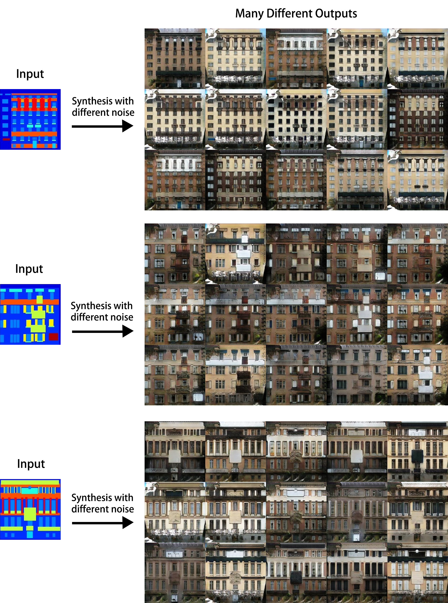
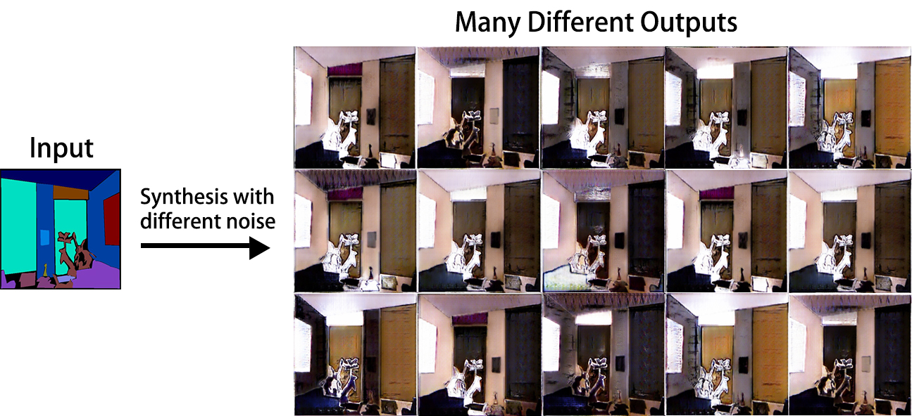

# Diverse Image Synthesis with PyTorch

This is a PyTorch implementation of the models in our paper "On the Diversity of Conditional Image Synthesis with Semantic Layouts". In the paper, we propose an approach to generate diverse realistic images, corresponding to a single semantic layout. Moreover, the training process do not require data pairing, just like the CycleGAN. If you are interesting in the details, you can refer to our papers.

Paper Link: [Journal(latest version)](https://ieeexplore.ieee.org/document/8607041)/[Arxiv(early version with a different title)](https://arxiv.org/abs/1712.07329)

Here, we implement our approach in unpaired training setting. Most parts of the codes are based on the PyTorch implementation of Pix2pix and CycleGAN by Junyan Zhu. Many thanks to their contributions to this community.


## Introduction

First of all, make sure that your machine have a GPU, with cuda 8.0 installed. We only test this code in one of our Debian servers, with the following python2 package dependencies.

	pytorch==0.1.12
	torchvision==0.2.1
	dominate==2.3.1
	visdom==0.1.8.3

If all are satisfied, please clone this repository.


## Preparing Datasets

The datasets used in our papers are CMP Facades, Cityscapes, and NYU Indoor Depth V2. But, in fact every image datasets with semantic layouts given can be used to train our model.


### Preprocessed CMP Facades Dataset

We have preprocessed a dataset for you. Just download from this [LINK](https://drive.google.com/open?id=1pbf_0v6M7MBcehUGoQpTFCz8QdSXQaX1). If you just follow the commands in the next section, please put the unzipped folder ```facades``` into the folder ```datasets``` in the repository. Otherwise, please modify the argument '--data' in the files ```train.py``` and ```sample.py```.


### Creating Your Datasets

Suppose that now you have a set of images and a corresponding set of semantic layouts with the number of semantic classes is c. Firstly, you should put the set of images to the folder ```trainA``` and put the set of semantic layouts to the folder ```trainB```. 

Then, you should creating one-channel label images. For every semantic class, assign it a value from 0 to c-1(distinct from each other). Then, for each semantic layout in the folder ```trainB```, create a one-channel image where every pixel is assigned the value of the semantic class of the corresponding pixel in the semantic layout. Next, put all of these one-channel images into the folder ```trainC```. Note that the semantic layout and the corresponding one-channel label image should be paired, i.e., the prefix numbers of their filenames should be the same.

Finally, you should make sure that the format of filenames follows from the one we used in the previous section. And, you should save all images in the JPEG format. Alternatively, you can modify our codes.


## Training and Sampling

### Training with CMP Facades
If you want to train with our preprocessed data, just run the following commands: it will activate a web server in port 8097, for displaying results. Then, start to train a model to generate diverse facades, using a GPU. The default GPU number is 0.

	python -m visdom.server
	python train.py

You can monitor the training process via your browser. The results are shown in port 8097.


### Sampling Diverse Facades

After the ending of the previous training process, if you want to sample diverse facades, please run the following command. And find the results in the folder ```./result/facades_unet/sample```.

	python sample.py


### Try Your Own Datasets

If you want to train your models with your own datasets, we guess that you could refer to the following descriptions of program arguments.

	--data				path to your dataset
	--taskname			using this name to distinguish experiments
	--generator			network architecture of the generator
	--channel			number of channels of the generator
	--norm				normalization layer used in our model
	--layerD 			depth of the discriminator
	--numberclasses			number of semantic classes of the 
	--alpha				weight of cycle loss
	--gamma				weight of diversity loss
	--Lambda			consistency parameter(<= 1.0)
	--lr 				learning rate
	--epoch 			total number of epoch
	--decayepoch			the epoch that learning rate starts to decay(<= --epoch)
	--batchsize			size of each batch(it must be 1?)
	--rescalesize			data augmentation, first scale to this size
	--cropsize			data augmentation, then crop to this size
	--resume			if resume training process
	--currentepoch			the epoch it resumes from
	--gpu 				select your GPU to train the model, only one GPU allowed


## Results

If you completely go through the previous experiment on facades generation. You will obtain many sets of diverse facades corresponding to the semantic layouts. We show some example sets of synthesized diverse images below.

<div align="center">
  <br><br>
</div>

In our papers, we also run experiments on the NYU Indoor Scene Depth dataset V2. The synthesized images are shown below, too. To be honest, the quality of synthesized examples of our models on this dataset is not so good because of the complexity of this dataset. We guess that training a generator of much larger capacity can improve the image quality.

<div align="center">
  <br><br>
</div>


## Contact Us

If you have any questions on the codes or our papers. Please feel free and directly contact us via e-mails, in English, Mandarin Chinese(中文), or Japanese(日本語). An active e-mail address of the corresponding author is zichenyang DOT math AT gmail DOT com. 

We do not recommend you to post a GitHub issue, because the corresponding author does not check it regularly. So, it may cause an unexpected delay.


## Citation

If our work helps your research, please cite us using the following bibtex. Thank you!

	@article{yang2019diversity,
	  title={On the Diversity of Conditional Image Synthesis with Semantic Layouts},
	  author={Yang, Zichen and Liu, Haifeng and Cai, Deng},
	  journal={IEEE Transactions on Image Processing},
	  year={2019},
	  publisher={IEEE}
	}
